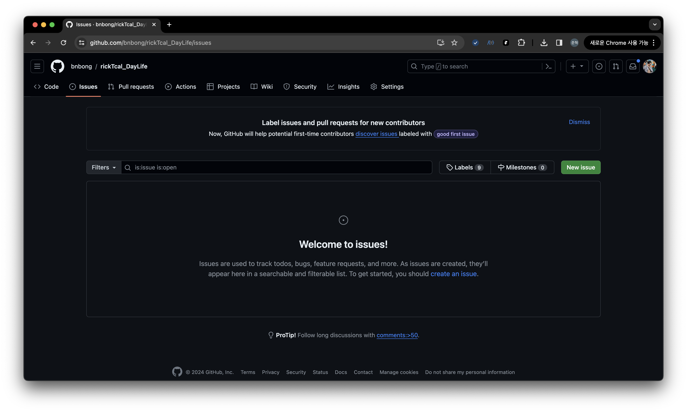
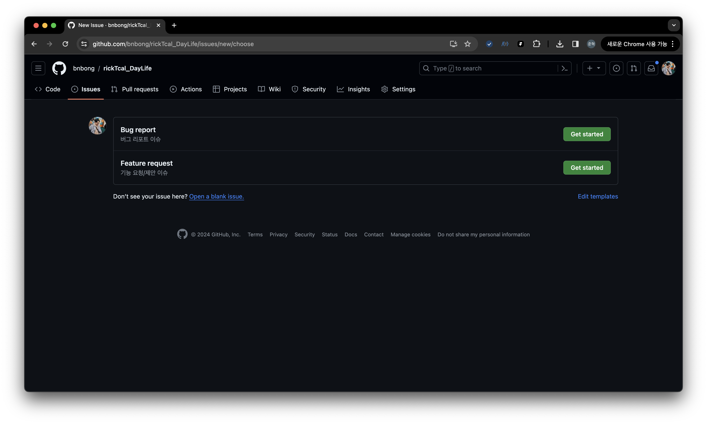
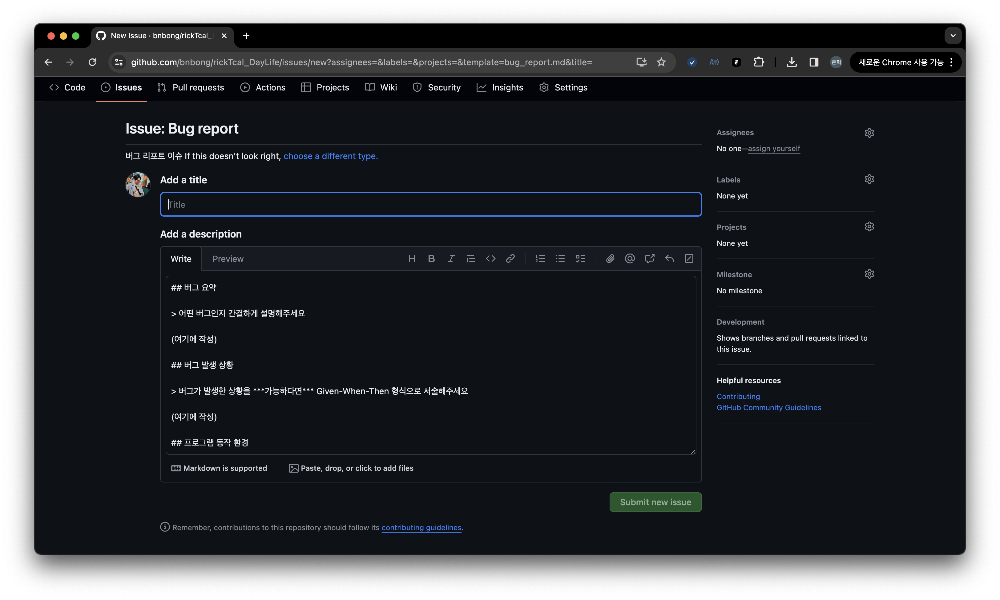
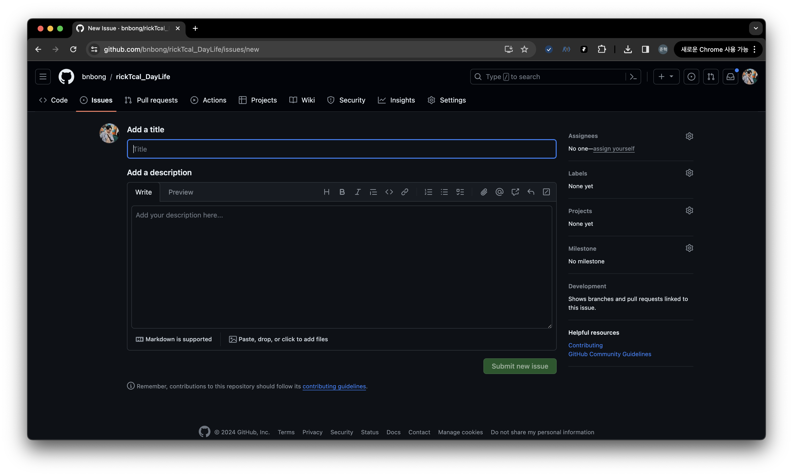

# CONTRIBUTING

rickTcal_DayLife 프로젝트 기여 방법에 대한 내용을 담은 문서입니다.

(목차 추가 예정)

# 문서 및 에셋 관련 기여

## PR / Issue 작성 방법

### Issue Reporting

rickTcal_DayLife github 저장소 상단의 Issues 탭을 눌러 그동안 생성된 이슈들을 볼 수 있으며 새로운 이슈를 생성할 수 있습니다.



rickTcal_DayLife 프로젝트가 제공하는 template로 이슈를 작성할 수 있습니다.

이슈를 생성하기 위해 먼저, 우측의 New issue 버튼을 누릅니다.



그리고 나타나는 화면에서, 원하는 이슈 template을 선택한 후, 이슈를 작성합니다.

template을 선택하면 다음과 같이 이슈를 작성할 수 있는 양식이 화면이 나타납니다.



만약, template를 사용하지 않고 자유롭게 이슈를 작성하고 싶으시다면,


template 선택창 하단의 [Open a blank issue](https://github.com/bnbong/rickTcal_DayLife/issues/new) 버튼을 눌러 자유 양식의 이슈를 작성할 수 있습니다.



### Pull Request

PR의 경우, Issue Reporting과 동일하게 rickTcal_DayLife 저장소가 제공하는 template로 PR을 작성할 수 있습니다.

PR을 보낼 부모 저장소의 **main 브랜치**로 PR을 보내주시면 됩니다.

## 번역

추가 예정

## 사도 추가

### 1. 사도 애니메이션 저장 폴더 생성

모든 사도의 애니메이션은 `/images/static/<사도영어이름_소문자>` 폴더에 위치해있습니다.

소스코드 또한 해당 폴더를 바탕으로 애니메이션을 불러오기 때문에 반드시 상단에 안내드린 위치에 애니메이션을 폴더링해야합니다.

예를 들어, 트릭컬 사도 '아멜리아'를 추가하고 싶다면 우선 `/images/static/` 폴더에 아멜리아의 영어 이름인 `amelia` 라는 이름의 폴더를 만든 후
해당 폴더에 애니메이션 GIF 파일을 넣으면 됩니다.

각 사도 애니메이션 폴더는 `default` `moving` 하위 폴더가 존재합니다.

각각 IDLE 애니메이션, 움직이는 애니메이션을 저장하는 폴더입니다. 이 구조 또한 포함시켜주세요.

moving 폴더는 볼따구를 늘리거나 놓은 후 애니메이션이 포함됩니다. 추후 업데이트로 사도가 소환/뛰어다니는 애니메이션도 해당 폴더에 추가될 예정입니다.

**사도 폴더 구조 정리**   
```
/images/static/<사도영어이름_소문자>
├── default // IDLE 애니메이션
│   ├── <사도영어이름_소문자>0.gif (IDLE 애니메이션 1개 이상 필수)
│   ├── <사도영어이름_소문자>1.gif
│   ├── <사도영어이름_소문자>2.gif
│   └── ...
└── moving // 움직이는 애니메이션
    ├── <사도영어이름_소문자>bolddagu.gif // 볼따구 당길 때 애니메이션 (필수)
    ├── <사도영어이름_소문자>bolddaguafter.gif // 볼따구 놓을 때 애니메이션 (필수)
    └── 그 외 움직이는 애니메이션 ...
```

### 2. 사도 정보 데이터 추가

사도의 애니메이션 저장 공간을 생성하였으니, 이제 사도의 정보 데이터를 넣어줄 차례입니다.

사도의 정보는 루트 폴더의 `sado.json` 파일에서 관리됩니다.

비슷한 이름의 sado_test.json 파일은 파일명 그대로 로컬 테스트 용으로 자유롭게 값을 변경하여 테스트를 할 수 있는 테스트용 사도 데이터 파일입니다.

사도 테스트는 [문서]()에서 설명드리고 있습니다.

(사도 테스트 및 json 파일 필드 설명 추가)

### 3. 애니메이션 파일 규격

애니메이션 파일의 공통 규격은 다음과 같습니다 : 1440x1440
(다음 내용을 추가 : 발 끝 맞추기?)

### 4. 볼따구 위치 찾기
x, y 위치 변경

# 코드 기여

먼저 해당 저장소를 포크한 후, 포크한 저장소에서 작업을 진행합니다.

## 개발 환경 설정 방법

1. Python 3.11 설치
2. PyQt6 설치
3. 프로젝트 파일 열기

또는 로컬에 Poetry가 설치되어 있을 시, (poetry로 의존성 관리 예정)
    
 ```bash
 poetry install
 ```

## 배포 실행 파일 생성 방법

실행 파일 아이콘 :
- MacOS 용 : [rickTcal.icns](images/static/rickTcal.icns)
- Windows 용 : [rickTcal.ico](images/static/rickTcal.ico)

### 0. pyinstaller 설치
```bash
# 로컬에 pyinstaller 개별 설치
$ pip install pyinstaller
```

```bash
# 또는 로컬에 개발 환경 의존성 통합 설치
$ pip install -r requirements.txt
```


### 1. 명렁어 실행
 - 실행 파일 생성
```bash
# 프로젝트 루트에서,

# Windows 환경
$ pyinstaller build_window.spec

# MacOS 환경
$ pyinstaller build_macos.spec
```
 - 빌드 설정 초기화 및 새로운 실행 파일 생성(웬만하면 실행하지 말 것.)
```bash
# 프로젝트 루트에서,

# MacOS 환경
$ pyinstaller --onefile --windowed --icon=src/static/rickTcal.icns src/main.py

# Windows 환경
$ pyinstaller --onefile --windowed --icon=src/static/rickTcal.ico src/main.py
```