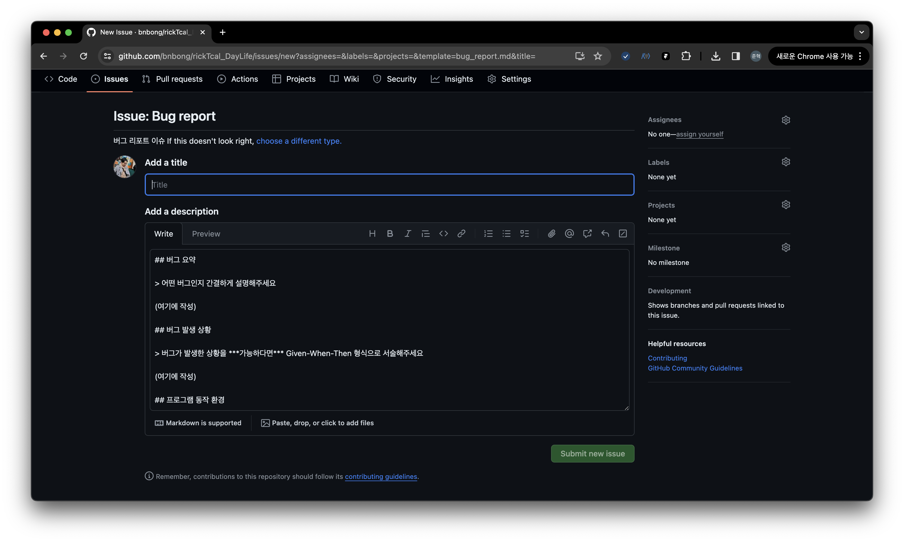

# CONTRIBUTING

---
# 문서 및 에셋 관련 기여

## PR / Issue 작성 방법

### Issue Reporting

rickTcal_DayLife github 저장소 상단의 Issues 탭을 눌러 그동안 생성된 이슈들을 볼 수 있으며 새로운 이슈를 생성할 수 있습니다.


rickTcal_DayLife 프로젝트가 제공하는 template로 이슈를 작성할 수 있습니다.

이슈를 생성하기 위해 먼저, 우측의 New issue 버튼을 누릅니다.


그리고 나타나는 화면에서, 원하는 이슈 template을 선택한 후, 이슈를 작성합니다.

template을 선택하면 다음과 같이 이슈를 작성할 수 있는 양식이 화면이 나타납니다.



만약, template를 사용하지 않고 자유롭게 이슈를 작성하고 싶으시다면,


template 선택창 하단의 [Open a blank issue](https://github.com/bnbong/rickTcal_DayLife/issues/new) 버튼을 눌러 자유 양식의 이슈를 작성할 수 있습니다.


### Pull Request

PR의 경우, Issue Reporting과 동일하게 rickTcal_DayLife 저장소가 제공하는 template로 PR을 작성할 수 있습니다.

PR을 보낼 부모 저장소의 **main 브랜치**로 PR을 보내주시면 됩니다.

## 번역

추가 예정

## 사도 추가

추가 예정 (사도 GIF 픽셀 크기 등)

# 코드 기여

먼저 해당 저장소를 포크한 후, 포크한 저장소에서 작업을 진행합니다.

## 개발 환경 설정 방법

1. Python 3.11 설치
2. PyQt6 설치
3. 프로젝트 파일 열기

또는 로컬에 Poetry가 설치되어 있을 시, (poetry로 의존성 관리 예정)
    
 ```bash
 poetry install
 ```

## 배포 실행 파일 생성 방법

실행 파일 아이콘 :
- MacOS 용 : [rickTcal.icns](images/static/rickTcal.icns)
- Windows 용 : [rickTcal.ico](images/static/rickTcal.ico)

### 0. pyinstaller 설치
```bash
# 로컬에 pyinstaller 개별 설치
$ pip install pyinstaller
```

```bash
# 또는 로컬에 개발 환경 의존성 통합 설치
$ pip install -r requirements.txt
```


### 1. 명렁어 실행
 - 실행 파일 생성
```bash
# 프로젝트 루트에서,

$ pyinstaller main.spec
```
 - 빌드 설정 초기화 및 새로운 실행 파일 생성(웬만하면 실행하지 말 것.)
```bash
# 프로젝트 루트에서,

# MacOS 환경
$ pyinstaller --onefile --windowed --icon=src/static/rickTcal.icns src/main.py

# Windows 환경
$ pyinstaller --onefile --windowed --icon=src/static/rickTcal.ico src/main.py
```