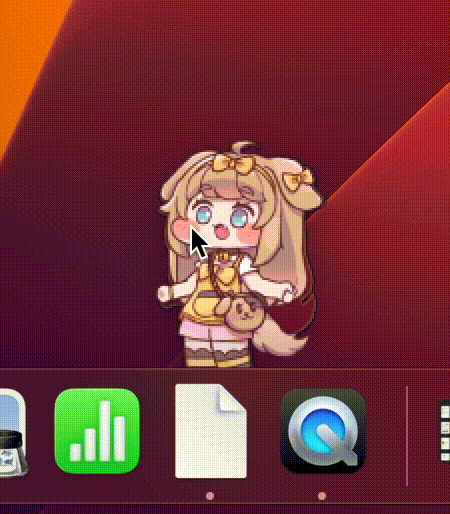
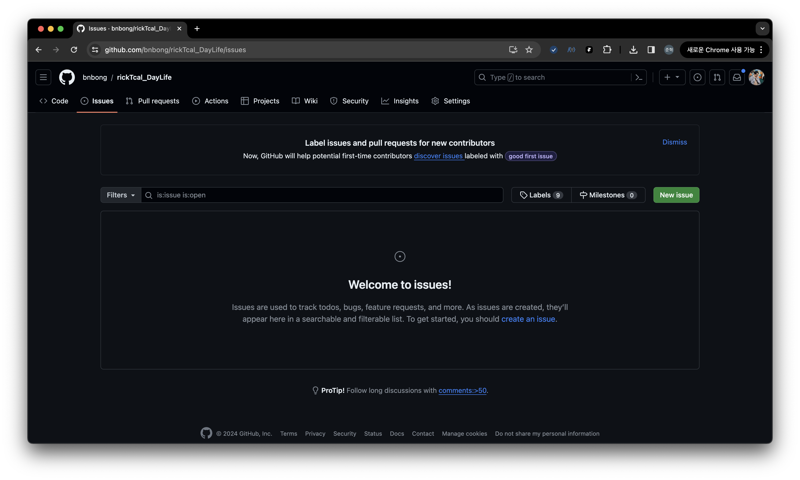
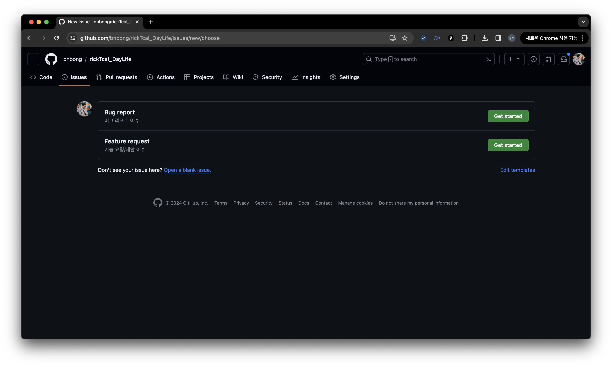
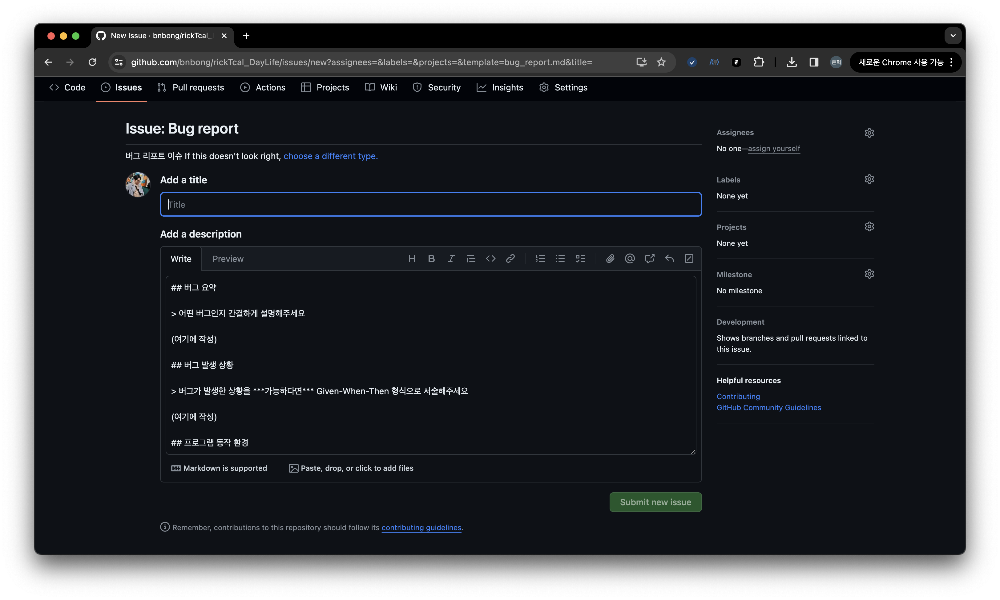
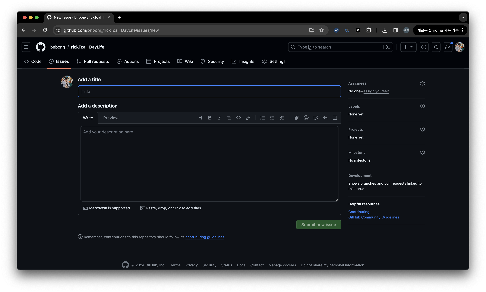

# rickTcal_DayLife

  

릭트컬 데이라이프 - 볼따구 라이프로 스트레스를 줄여주는 데스크톱 앱

본 프로젝트는 한양대학교 ERICA 소프트웨어융합대학 학회 Jaram 2024 1학기 워크샵 대체 과제 프로젝트로 진행되었습니다.

현 프로젝트 아이디어의 출처는 2023년에 출시한 에피드 게임즈의 [트릭컬 리바이브](https://trickcal.com/) 에 있습니다.

릭트컬 데이라이프 프로젝트는 ***트릭컬 리바이브 게임의 2차 창작 프로젝트이며, 비영리&비상업 용도로 제작된 개인 프로젝트 입니다.
프로젝트 내에 어떠한 수익창출 모델이 존재하지 않습니다.***

❗ 해당 프로젝트는 오픈소스 프로젝트로 소스코드 및 사용된 이미지가 공개되어 있는 상태입니다. ***외부 요청에 따라 프로젝트가 비공개로 전환되거나 삭제될 수 있습니다.***

## 프로젝트 개요

### 요약

 - 워크샵 프로젝트 주제 : 자신의 개발에 도움이 될 데스크탑 애플리케이션 개발
 - 사용할 도구 : PyQt6(Python 3.11)
 - 요구 기술 : 볼따구 잡아 당기고 놓는 기능(메인 feature), 캐릭터 선택 기능(사이드 feature), 크로스 플랫폼(Windows, Mac, Linux) 지원
 - 담당자 : 이준혁(자람 39기, bnbong) - 기획, 개발

### 기능

1. **볼따구 잡아당기는 기능**

| 인게임 (트릭컬 리바이브)                                                                  | 릭트컬 - 데이라이프                                |
|---------------------------------------------------------------------------------|--------------------------------------------|
|   |  |

핵심 기능인 사도의 볼따구를 잡아당기는 기능입니다.

볼따구를 잡아당길 때와 놓을 때 효과음이 재생됩니다.

트릭컬 리바이브 인게임에서는 사도들의 볼따구를 잡아당기면 볼따구가 찹쌀떡 마냥 손가락을 따라 늘어나는 기능이 있지만,

릭트컬 - 데이라이프에서는 개발자 본인의 역량의 한계(...)로 볼따구가 커서를 따라 늘어나는 기능이 추가될 수 있을지는 미지수입니다.

2. **사도(캐릭터)에 대한 정보 열람 및 바탕화면에 사도 추가**

우측 하단의 캐릭터 아이콘 버튼을 클릭하면 사도 설명과 설명을 보고 있는 사도를 바탕화면에 추가하는 다이얼로그가 표시됩니다.

### 프로젝트 목표

 - 개발로 고통받는 자람 학회원에게 일상 생활(모니터 속) 볼따구 라이프로 스트레스를 줄여주는 데스크톱 앱을 개발한다.
 - 사도(캐릭터)들의 볼따구를 튕기며 멍을 때리는 **볼따구 라이프**는 <u>스트레스 해소 효과 뿐만아니라 창의력과 기억력을 높이는 효능</u>도 있다. 
   - 관련 기사 - [링크](https://m.health.chosun.com/svc/news_view.html?contid=2023031701752)
 - 따라서 **자람 학회원을 포함한 릭트컬 데이라이프 데스크톱 앱을 사용하는 모든 사용자**에게 스트레스 해소, 창의력 및 기억력 증진 도모를 목표로 한다.

### 설치 방법

추가 예정

### 시연 영상

 > 사진을 클릭하면 유튜브 시연 영상 페이지로 넘어갑니다.

## Contribution

해당 프로젝트는 오픈소스 프로젝트로 진행이 되고 있으며, 누구나 자유롭게 해당 저장소에 기여를 하실 수 있습니다!

어떠한 형식의 기여든 너무나도 환영합니다 :)

문서 번역, 사도 추가, 코드 기여, 기능 제안 등 다양한 방법으로 프로젝트에 기여를 하실 수 있습니다.

프로젝트에 기여를 하고 싶으시다면, 아래의 방법으로 기여를 할 수 있습니다.

### Issue Reporting

버그 제보, 기능 제안 등의 이슈를 개발자에게 전달하고 싶으시다면, 하단의 방법을 통해 이슈를 생성하실 수 있습니다.

<b>이슈 생성하는 법</b>

rickTcal_DayLife github 저장소 상단의 Issues 탭을 눌러 그동안 생성된 이슈들을 볼 수 있으며 새로운 이슈를 생성할 수 있습니다.

rickTcal_DayLife 프로젝트가 제공하는 template로 이슈를 작성할 수 있습니다.

이슈를 생성하기 위해 먼저, 우측의 New issue 버튼을 누릅니다.

그리고 나타나는 화면에서, 원하는 이슈 template을 선택한 후, 이슈를 작성합니다.

template을 선택하면 다음과 같이 이슈를 작성할 수 있는 양식이 화면이 나타납니다.

만약, template를 사용하지 않고 자유롭게 이슈를 작성하고 싶으시다면,

template 선택창 하단의 [Open a blank issue](https://github.com/bnbong/rickTcal_DayLife/issues/new) 버튼을 눌러 자유 양식의 이슈를 작성할 수 있습니다.

### Code Contribution & Etc

자세한 내용은 [CONTRIBUTION.md](CONTRIBUTING.md) 파일을 통해 확인할 수 있습니다.

### 개발 Stack

 - Python 3.11.1
 - PyQt6

## 버전 노트 및 패치 내역

추후 버전에 추가될 기능 혹은 패치될 내역들은 [CHANGELOG.md](CHANGELOG.md) 파일을 통해 확인할 수 있습니다.